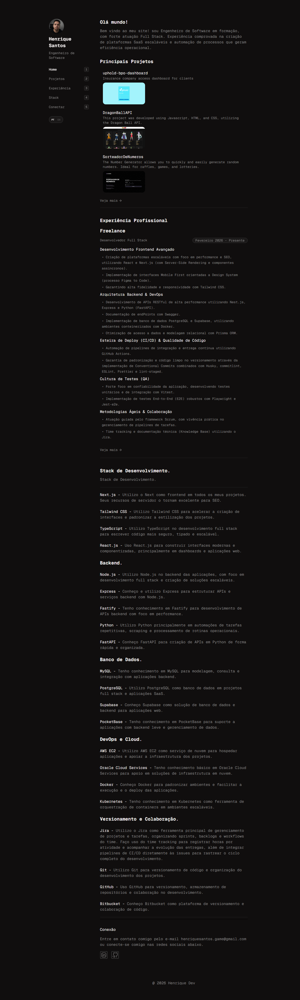

# 👨‍💻 Portfólio Pessoal - Software Engineer



Bem-vindo ao repositório do meu Portfólio Pessoal. Este projeto não é apenas uma vitrine visual das minhas habilidades, mas também uma demonstração técnica das melhores práticas de arquitetura escalável e fundamentos de Engenharia de Software focados no mercado corporativo (Enterprise Ready).

---

## 🚀 Arquitetura e Decisões Técnicas

Todo o projeto foi construído para aliar velocidade, organização e facilidade de manutenção. As decisões técnicas a seguir detalham esse foco:

### 🐳 Containerização (Docker Multi-Stage & Nginx)

Aplicação **100% conteinerizada** para garantia de imutabilidade entre ambientes:

- **Build Otimizado:** Utilização de _Multistage Dockerfile_. Estágio inicial (`node:alpine`) baixa dependências com cache nativo e transpila os arquivos (`dist`). A pesada pasta `node_modules` fica para trás.
- **Servidor Leve:** O resultado final é entregue à imagem enxuta do `nginx:alpine-slim`, gerando um pacote diminuto em megabytes.
- **Configuração Nginx de Alta Performance:** Uso de fallback natural no roteamento SPA de React e instruções de Cache Severo (HTTP Headers `immutable`) para assets estáticos.

### 🎭 Componentes Polimórficos

Rejeitamos a hiperdependência de classes CSS embutidas de forma desorganizada, e abraçamos Arquitetura de Componentização Sólida:

- Foram introduzidos componentes de abstração textual e de temas (ex: `<Text as="h1" variant="heading-lg" />`), o que centraliza nosso sistema de Design via CVA (_Class Variance Authority_) em sinergia perfeita com as utilidades do TailwindCSS.

### ⚡ Caching, `useMemo` & Gestão de Estado

Performance na render tree controlada sem sobrecarregar a estrutura:

- O custom hook `useGithub.jsx` usa inteligência estrita no `useEffect` suportado por um dicionário local de chamas passadas (`cache object`). Assim, acessos iterativos a página não gastam a limitação de requisições da _API pública do GitHub_.
- Aproveitamento inteligente e conceitual do uso de `useMemo` e referências blindando componentes de passarem por re-renderizações parasitas na árvore DOM após interações nos painéis do usuário.

### 🗺️ Roteamento Contextual e i18n

Experiência interativa (SPA) com escalabilidade multinacional ativada:

- A rota global da página foi envolta nativamente sob escopos do `react-router-dom` combinando com um `<LanguageSwitcher />`.
- Contextos controlados pelo `react-i18next` gerindo perfeitamente as transições e textos entre os idiomas de forma declarativa (Inglês e Português `en/pt`) e carregando de forma assíncrona dicionários formatados em JSON (`en.json`, `pt.json`). Escopo visual (como Sidebar e Menu principal) nunca perdem o estado durante esse _switch_.

## 🛠️ Tecnologias Utilizadas

- **Core:** Vite + React (v19)
- **Visual:** Tailwind CSS v4 + Framer Motion + Lucide Icons + Huge Icons
- **Gestão de Estilos:** Class Variance Authority (CVA)
- **Rotas:** React Router DOM
- **Localização:** React-i18next (Browser Language Detector nativo)
- **Testes & CI/CD:** Integração via ES Lint + Husky + Vitest + Playwright + Automações no GitHub Actions
- **Infra/Deploy:** Docker Engine + GitHub Container Registry

---

## ⚙️ Como rodar o projeto

### Via Node localmente:

```bash
# Baixar dependências
pnpm install

# Servidor de desenvolvimento
pnpm run dev
```

### Via Docker (Recomendado):

Certifique-se de estar com o Docker rodando na sua máquina.

```bash
# Construir a imagem localmente (Aproveitamento total Multi-stage)
docker build -t app-portfolio .

# Subir a imagem mapeando diretamente para a porta 8080 do computador
docker run -d -p 8080:80 app-portfolio
```

Feito isso, abra `http://localhost:8080` no navegador.
